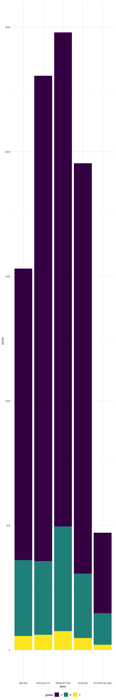
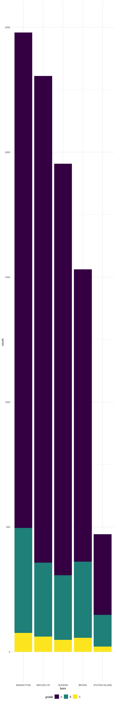

strings\_and\_factors
================
Kaila Boyer
10/23/2021

## String vectors

``` r
string_vec <- c("my", "name", "is", "jeff")

str_detect(string_vec, "jeff")
```

    ## [1] FALSE FALSE FALSE  TRUE

``` r
str_detect(string_vec, "m")
```

    ## [1]  TRUE  TRUE FALSE FALSE

``` r
str_replace(string_vec, "jeff", "Jeff")
```

    ## [1] "my"   "name" "is"   "Jeff"

``` r
str_replace(string_vec, "e", "Jeff")
```

    ## [1] "my"      "namJeff" "is"      "jJeffff"

``` r
string_vec1 <- c(
  "I think we all rule for participating", 
  "I think i have been caught", 
  "i think this will be quite fun actually",
  "it will be fun, i think"
)

str_detect(string_vec1, "^i think")
```

    ## [1] FALSE FALSE  TRUE FALSE

``` r
str_detect(string_vec1, "i think$")
```

    ## [1] FALSE FALSE FALSE  TRUE

``` r
string_vec = c(
  "Y'all remember Pres. HW Bush?",
  "I saw a green bush",
  "BBQ and Bushwalking at Molonglo Gorge",
  "BUSH -- LIVE IN CONCERT!!"
  )

str_detect(string_vec,"[Bb]ush")
```

    ## [1]  TRUE  TRUE  TRUE FALSE

``` r
str_detect(string_vec,"bush")
```

    ## [1] FALSE  TRUE FALSE FALSE

``` r
str_detect(string_vec,"Bush")
```

    ## [1]  TRUE FALSE  TRUE FALSE

The character . matches anything.

``` r
string_vec = c(
  '7th inning stretch',
  '1st half soon to begin. Texas won the toss.',
  'she is 5 feet 4 inches tall',
  '3AM - cant sleep :('
  )

str_detect(string_vec, "^[0-9][a-zA-Z]")
```

    ## [1]  TRUE  TRUE FALSE  TRUE

``` r
string_vec = c(
  'Its 7:11 in the evening',
  'want to go to 7-11?',
  'my flight is AA711',
  'NetBios: scanning ip 203.167.114.66'
  )

str_detect(string_vec, "7.11")
```

    ## [1]  TRUE  TRUE FALSE  TRUE

Some characters are “special”. These include \[ and \], ( and ), and ..
If you want to search for these, you have to indicate they’re special
using . Unfortunately,  is also special, so things get weird.

``` r
string_vec = c(
  'The CI is [2, 5]',
  ':-]',
  ':-[',
  'I found the answer on pages [6-7]'
  )

str_detect(string_vec, "\\[")
```

    ## [1]  TRUE FALSE  TRUE  TRUE

## Why factors are weird

``` r
factor_vec <- factor(c("male", "male", "female", "female"))

as.numeric(factor_vec)
```

    ## [1] 2 2 1 1

``` r
factor_vec <- fct_relevel(factor_vec, "male")
as.numeric(factor_vec)
```

    ## [1] 1 1 2 2

## NSDUH

``` r
nsduh_rul <- "http://samhda.s3-us-gov-west-1.amazonaws.com/s3fs-public/field-uploads/2k15StateFiles/NSDUHsaeShortTermCHG2015.htm"

table_marj <- read_html(nsduh_rul) %>% 
  html_table() %>% 
  first() %>% 
  slice(-1)
```

Clean up table

``` r
table_marj %>% 
  select(-contains("P Value")) %>% 
  pivot_longer(-State, 
               names_to = "age_year", 
               values_to = "percent") %>% 
  separate(age_year, into = c("age", "year"), -11)
```

    ## # A tibble: 560 × 4
    ##    State      age   year        percent
    ##    <chr>      <chr> <chr>       <chr>  
    ##  1 Total U.S. 12+   (2013-2014) 12.90a 
    ##  2 Total U.S. 12+   (2014-2015) 13.36  
    ##  3 Total U.S. 12-17 (2013-2014) 13.28b 
    ##  4 Total U.S. 12-17 (2014-2015) 12.86  
    ##  5 Total U.S. 18-25 (2013-2014) 31.78  
    ##  6 Total U.S. 18-25 (2014-2015) 32.07  
    ##  7 Total U.S. 26+   (2013-2014) 9.63a  
    ##  8 Total U.S. 26+   (2014-2015) 10.25  
    ##  9 Total U.S. 18+   (2013-2014) 12.87a 
    ## 10 Total U.S. 18+   (2014-2015) 13.41  
    ## # … with 550 more rows

``` r
marj_df <- table_marj %>% 
  select(-contains("P Value")) %>% 
  pivot_longer(-State, 
               names_to = "age_year", 
               values_to = "percent") %>% 
  separate(age_year, into = c("age", "year"), "\\(") %>% 
  mutate(year = str_replace(year, "\\)", ""),
         percent = str_replace(percent, "[a-c]$", ""), 
         percent = as.numeric(percent)) %>% 
  filter(!(State %in% c("Total U.S.", "Northeast", "Midwest", "South", "West")))
```

``` r
marj_df %>% 
  filter(age == "12-17") %>% 
  mutate(
    State = fct_reorder(State, percent)
  ) %>% 
  ggplot(aes(x = State, y = percent, color = year)) + 
  geom_point() + 
  theme(axis.text = element_text(angle = 90, vjust = 0.5, hjust = 1))
```


## Restaurant inspections

``` r
data("rest_inspec")

rest_inspec %>% slice(1:100) %>% View()

rest_inspec %>% 
  janitor::tabyl(boro, grade) 
```

    ##           boro     A     B    C Not Yet Graded   P    Z   NA_
    ##          BRONX 13688  2801  701            200 163  351 16833
    ##       BROOKLYN 37449  6651 1684            702 416  977 51930
    ##      MANHATTAN 61608 10532 2689            765 508 1237 80615
    ##        Missing     4     0    0              0   0    0    13
    ##         QUEENS 35952  6492 1593            604 331  913 45816
    ##  STATEN ISLAND  5215   933  207             85  47  149  6730

``` r
rest_inspec %>% 
  group_by(boro, grade) %>% 
  summarise(count = n())
```

    ## `summarise()` has grouped output by 'boro'. You can override using the `.groups` argument.

    ## # A tibble: 37 × 3
    ## # Groups:   boro [6]
    ##    boro     grade          count
    ##    <chr>    <chr>          <int>
    ##  1 BRONX    A              13688
    ##  2 BRONX    B               2801
    ##  3 BRONX    C                701
    ##  4 BRONX    Not Yet Graded   200
    ##  5 BRONX    P                163
    ##  6 BRONX    Z                351
    ##  7 BRONX    <NA>           16833
    ##  8 BROOKLYN A              37449
    ##  9 BROOKLYN B               6651
    ## 10 BROOKLYN C               1684
    ## # … with 27 more rows

``` r
rest_inspec %>% 
  filter(str_detect(grade, "[ABC]"), 
  !(boro == "Missing")) %>% 
  mutate(boro = str_to_title(boro))
```

    ## # A tibble: 188,195 × 18
    ##    action        boro   building  camis critical_flag cuisine_descrip… dba      
    ##    <chr>         <chr>  <chr>     <int> <chr>         <chr>            <chr>    
    ##  1 Violations w… Manha… 1271     5.00e7 Critical      American         THE HARO…
    ##  2 Violations w… Manha… 37       4.12e7 Not Critical  Korean           SHILLA K…
    ##  3 Violations w… Manha… 53       4.04e7 Not Critical  Korean           HAN BAT …
    ##  4 Violations w… Manha… 287      4.16e7 Not Critical  American         BRGR     
    ##  5 Violations w… Manha… 800      4.11e7 Not Critical  Pizza            WALDY'S …
    ##  6 Violations w… Manha… 121      5.00e7 Not Critical  Café/Coffee/Tea LUNA     
    ##  7 Violations w… Manha… 124      4.10e7 Critical      American         JOHNY'S …
    ##  8 Violations w… Manha… 138      4.11e7 Critical      American         AROME CA…
    ##  9 Violations w… Manha… 839      5.00e7 Not Critical  American         L'AMICO/…
    ## 10 Violations w… Manha… 35       4.13e7 Critical      Korean           MADANGSUI
    ## # … with 188,185 more rows, and 11 more variables: inspection_date <dttm>,
    ## #   inspection_type <chr>, phone <chr>, record_date <dttm>, score <int>,
    ## #   street <chr>, violation_code <chr>, violation_description <chr>,
    ## #   zipcode <int>, grade <chr>, grade_date <dttm>

``` r
rest_inspec %>% 
  filter(str_detect(dba, "[Pp][Ii][Zz][Zz][Aa]"), 
  str_detect(grade, "[ABC]"))  %>% 
  janitor::tabyl(boro, grade)
```

    ##           boro    A   B  C
    ##          BRONX 1170 305 56
    ##       BROOKLYN 1948 296 61
    ##      MANHATTAN 1983 420 76
    ##         QUEENS 1647 259 48
    ##  STATEN ISLAND  323 127 21

``` r
rest_inspec %>% 
  filter(str_detect(dba, "[Pp][Ii][Zz][Zz][Aa]"), 
  str_detect(grade, "[ABC]"))  %>% 
  ggplot(aes(x = boro, fill = grade)) + 
  geom_bar()
```



``` r
rest_inspec %>% 
  filter(str_detect(dba, "[Pp][Ii][Zz][Zz][Aa]"), 
  str_detect(grade, "[ABC]"))  %>% 
  mutate(boro = fct_infreq(boro)) %>% 
  ggplot(aes(x = boro, fill = grade)) + 
  geom_bar()
```



Changing a label

``` r
rest_inspec %>% 
  filter(str_detect(dba, "[Pp][Ii][Zz][Zz][Aa]"), 
  str_detect(grade, "[ABC]"))  %>%
  mutate(boro = fct_infreq(boro), 
         boro = fct_recode(boro, "The City" = "Manhattan")) %>% 
  ggplot(aes(x = boro, fill = grade)) + 
  geom_bar()
```
