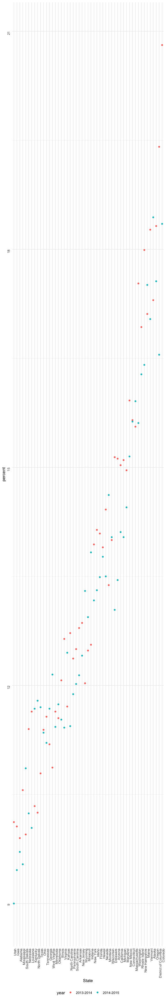

strings\_and\_factors
================
Kaila Boyer
10/23/2021

## String vectors

``` r
string_vec <- c("my", "name", "is", "jeff")

str_detect(string_vec, "jeff")
```

    ## [1] FALSE FALSE FALSE  TRUE

``` r
str_detect(string_vec, "m")
```

    ## [1]  TRUE  TRUE FALSE FALSE

``` r
str_replace(string_vec, "jeff", "Jeff")
```

    ## [1] "my"   "name" "is"   "Jeff"

``` r
str_replace(string_vec, "e", "Jeff")
```

    ## [1] "my"      "namJeff" "is"      "jJeffff"

``` r
string_vec1 <- c(
  "I think we all rule for participating", 
  "I think i have been caught", 
  "i think this will be quite fun actually",
  "it will be fun, i think"
)

str_detect(string_vec1, "^i think")
```

    ## [1] FALSE FALSE  TRUE FALSE

``` r
str_detect(string_vec1, "i think$")
```

    ## [1] FALSE FALSE FALSE  TRUE

``` r
string_vec = c(
  "Y'all remember Pres. HW Bush?",
  "I saw a green bush",
  "BBQ and Bushwalking at Molonglo Gorge",
  "BUSH -- LIVE IN CONCERT!!"
  )

str_detect(string_vec,"[Bb]ush")
```

    ## [1]  TRUE  TRUE  TRUE FALSE

``` r
str_detect(string_vec,"bush")
```

    ## [1] FALSE  TRUE FALSE FALSE

``` r
str_detect(string_vec,"Bush")
```

    ## [1]  TRUE FALSE  TRUE FALSE

The character . matches anything.

``` r
string_vec = c(
  '7th inning stretch',
  '1st half soon to begin. Texas won the toss.',
  'she is 5 feet 4 inches tall',
  '3AM - cant sleep :('
  )

str_detect(string_vec, "^[0-9][a-zA-Z]")
```

    ## [1]  TRUE  TRUE FALSE  TRUE

``` r
string_vec = c(
  'Its 7:11 in the evening',
  'want to go to 7-11?',
  'my flight is AA711',
  'NetBios: scanning ip 203.167.114.66'
  )

str_detect(string_vec, "7.11")
```

    ## [1]  TRUE  TRUE FALSE  TRUE

Some characters are “special”. These include \[ and \], ( and ), and ..
If you want to search for these, you have to indicate they’re special
using . Unfortunately,  is also special, so things get weird.

``` r
string_vec = c(
  'The CI is [2, 5]',
  ':-]',
  ':-[',
  'I found the answer on pages [6-7]'
  )

str_detect(string_vec, "\\[")
```

    ## [1]  TRUE FALSE  TRUE  TRUE

## Why factors are weird

``` r
factor_vec <- factor(c("male", "male", "female", "female"))

as.numeric(factor_vec)
```

    ## [1] 2 2 1 1

``` r
factor_vec <- fct_relevel(factor_vec, "male")
as.numeric(factor_vec)
```

    ## [1] 1 1 2 2

## NSDUH

``` r
nsduh_rul <- "http://samhda.s3-us-gov-west-1.amazonaws.com/s3fs-public/field-uploads/2k15StateFiles/NSDUHsaeShortTermCHG2015.htm"

table_marj <- read_html(nsduh_rul) %>% 
  html_table() %>% 
  first() %>% 
  slice(-1)
```

Clean up table

``` r
table_marj %>% 
  select(-contains("P Value")) %>% 
  pivot_longer(-State, 
               names_to = "age_year", 
               values_to = "percent") %>% 
  separate(age_year, into = c("age", "year"), -11)
```

    ## # A tibble: 560 × 4
    ##    State      age   year        percent
    ##    <chr>      <chr> <chr>       <chr>  
    ##  1 Total U.S. 12+   (2013-2014) 12.90a 
    ##  2 Total U.S. 12+   (2014-2015) 13.36  
    ##  3 Total U.S. 12-17 (2013-2014) 13.28b 
    ##  4 Total U.S. 12-17 (2014-2015) 12.86  
    ##  5 Total U.S. 18-25 (2013-2014) 31.78  
    ##  6 Total U.S. 18-25 (2014-2015) 32.07  
    ##  7 Total U.S. 26+   (2013-2014) 9.63a  
    ##  8 Total U.S. 26+   (2014-2015) 10.25  
    ##  9 Total U.S. 18+   (2013-2014) 12.87a 
    ## 10 Total U.S. 18+   (2014-2015) 13.41  
    ## # … with 550 more rows

``` r
marj_df <- table_marj %>% 
  select(-contains("P Value")) %>% 
  pivot_longer(-State, 
               names_to = "age_year", 
               values_to = "percent") %>% 
  separate(age_year, into = c("age", "year"), "\\(") %>% 
  mutate(year = str_replace(year, "\\)", ""),
         percent = str_replace(percent, "[a-c]$", ""), 
         percent = as.numeric(percent)) %>% 
  filter(!(State %in% c("Total U.S.", "Northeast", "Midwest", "South", "West")))
```

``` r
marj_df %>% 
  filter(age == "12-17") %>% 
  mutate(
    State = fct_reorder(State, percent)
  ) %>% 
  ggplot(aes(x = State, y = percent, color = year)) + 
  geom_point() + 
  theme(axis.text = element_text(angle = 90, vjust = 0.5, hjust = 1))
```


